# The Founder Folks — UI/UX Audit + Bay Playbook v1 Handoff

**For:** Arnob (site owner — thefounderfolks.com main site + `/guides/the-bay-playbook`)
**From:** Shonik
**Date:** 2026-09-09
**Scope:** UX audit of the live site (main + bay-playbook), plus a v1 content package for the Bay Playbook (28 article pages, ready to drop into the site).

---

## TL;DR

Two things in this doc:

1. **UX audit findings** across `thefounderfolks.com` (home, /guides, /fundraising-decks, /contact) and `/guides/the-bay-playbook`. One critical mobile bug (horizontal scroll), a handful of accessibility issues, a few visibly broken interactions (contact form has no submit; decks page filter label with no filter).
2. **v1 content package** — 28 fully-written Bay Playbook pages, structured around a user's actual timeline (Decide → Paperwork → Before you fly → Land → Live in it → Business). Delivered as (a) plain-text content briefs one file per page and (b) `.dc.html` files matching the existing template. Repo: **[github.com/shonik-build/tff-bay-playbook-handoff](https://github.com/shonik-build/tff-bay-playbook-handoff)**.

Feedback from two conversations (Balu Murali, Ajay Yadav) is already folded into the content — not called out separately.

---

## 1) Main site — issues found

### 1.1 Homepage (`thefounderfolks.com`)

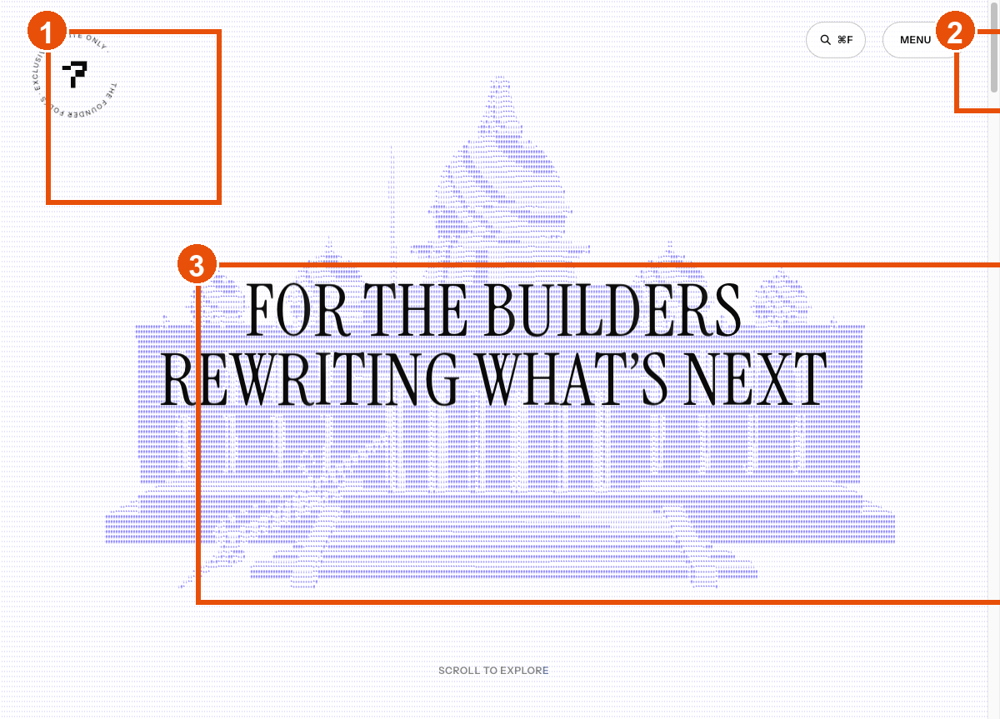

**① Circular logo lockup — rotate-to-read.** The "· EXCLUSIVE · INVITE ONLY ·" text is set on a circle. On desktop it reads OK once you tilt your head; on mobile (see 1.5) it becomes visual noise because no other content anchors the eye. Consider a straight-set tagline as fallback, or drop the rotation on ≤768px.

**② `MENU ::` glyph.** The double-colon isn't a standard menu affordance. First-time visitors don't parse this as "click me." An icon (hamburger, or the `::` treated as a decorative flourish on a labelled button) reads faster.

**③ Hero title `aria-label` is character-spaced.** The visible text ("FOR THE BUILDERS REWRITING WHAT'S NEXT") renders fine, but the `aria-label` is written as `F o r  t h e  b u i l d e r s…` — screen readers announce it letter-by-letter. Fix: set `aria-label` to the plain-text sentence.

### 1.2 Below the fold — mostly empty bands

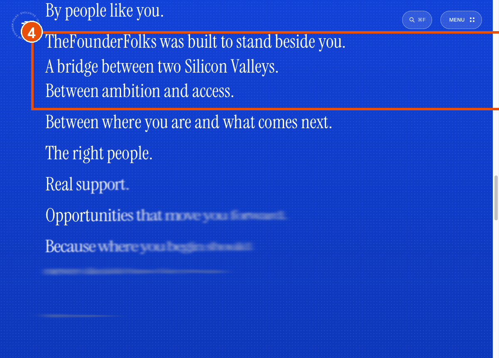
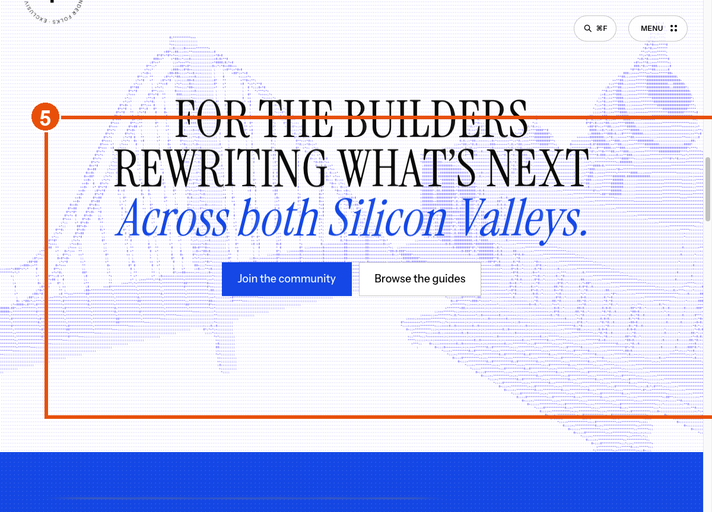

**④ / ⑤** The "What you get" and manifesto sections are large blue fields with 2–3 short lines each. It reads under-designed compared to the density on the hero. Either compress the vertical space or fill it (imagery, a running list of guides, testimonials, a signup form). Right now these sections train visitors to scroll faster and skip content.

### 1.3 Menu overlay

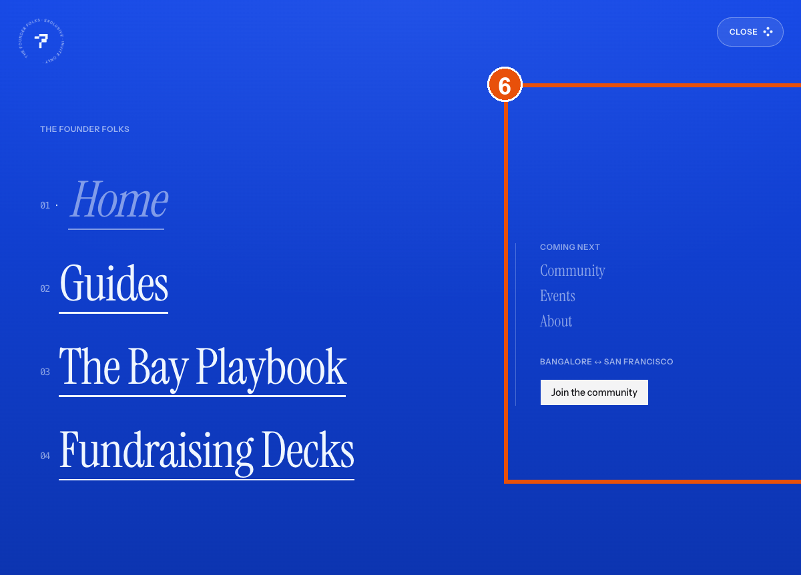

**⑥** The overlay has no visible close (X) affordance. Users have to guess: click outside, hit Escape, or click MENU again. Add an X in the top-right of the overlay — same location as the MENU button so the mental model is "the button toggles."

### 1.4 /guides, /fundraising-decks, /contact

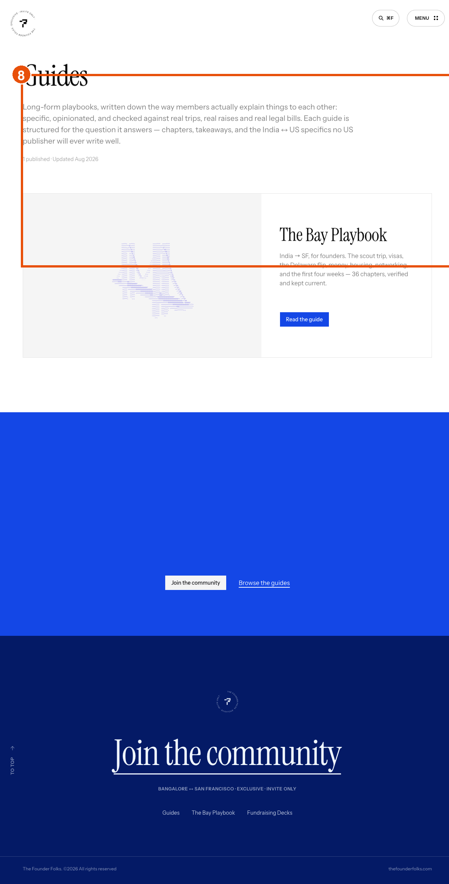

**⑧** `/guides` currently lists only the Bay Playbook. That's fine for launch, but the empty space below the single card makes the site feel unfinished. Options: a "coming soon" placeholder for the next guide, or reduce section height until there's ≥2 cards.

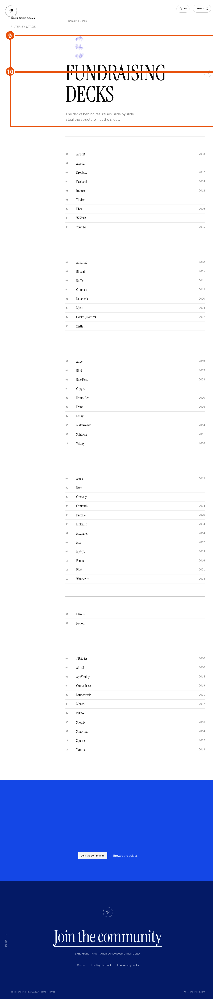

**⑨ "FILTER BY STAGE" label with no visible filter.** Either the control failed to render or the label is a leftover — remove the label or ship the control.

**⑩ Grouped rows without group headers.** The decks are grouped (pre-seed / seed / A) but there's no visual separator or header. A user reading top-to-bottom can't tell where one stage ends and the next begins. Add row-group headers ("Pre-seed", "Seed", "Series A") between the rows.

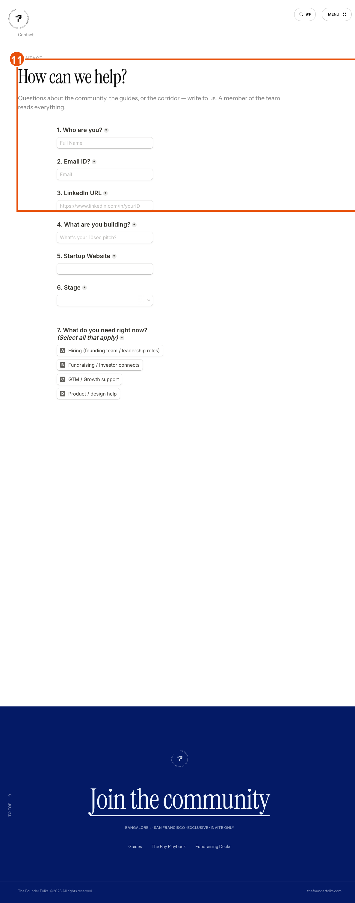

**⑪ Contact form has no visible submit button.** Confirmed via DOM — no `<button type="submit">` in the form. The form is currently unusable. This is the highest-severity bug on the main site.

### 1.5 Homepage — mobile (390px)

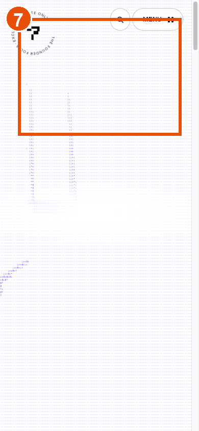

**⑦** On mobile, the hero collapses to just the rotating logo blob. The hero title ("FOR THE BUILDERS…") is missing entirely — I couldn't find it in the mobile viewport. Whatever CSS handles the hero-text position needs a mobile breakpoint.

---

## 2) Bay Playbook — issues found on the live subpage

### 2.1 Landing + TOC

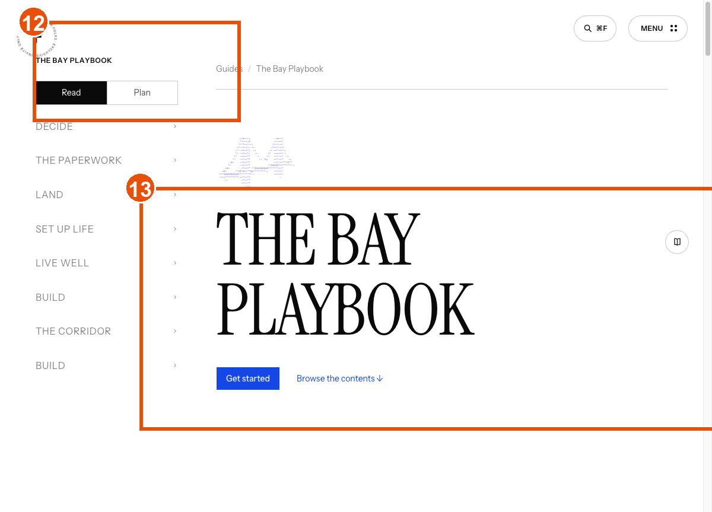
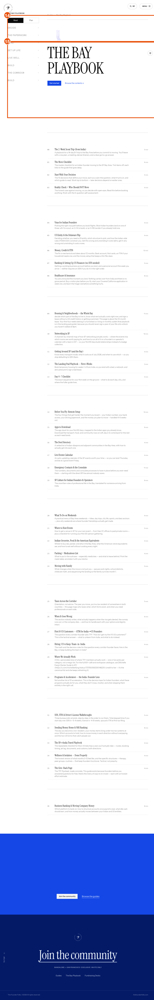

**⑫ / ⑬** Same rotating-badge issue as home. TOC below the fold is where the actual value lives — consider promoting a compact TOC to above-the-fold.

**⑭ Nav has "Build" section listed twice.** In the sidebar/TOC there are two group headers labelled "Build". Deduplicate.

**⑮ Article link text is duplicated 3× in the DOM.** Each TOC row renders the title 3 times (visible + sr-only variants). Screen readers hear "US Entity & the Delaware Flip. US Entity & the Delaware Flip. US Entity & the Delaware Flip." Tighten the template so the title appears once with the meta pieces as separate elements.

### 2.2 Article pages

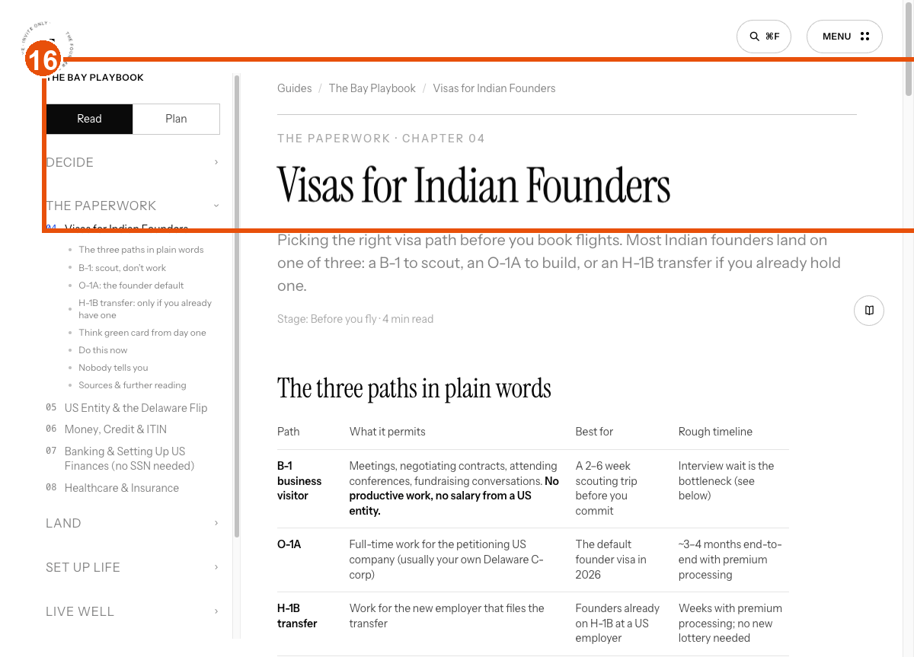

**⑯ "TO TOP" back-link low contrast.** Light text on a light background — fails WCAG AA at the current colour pair. Bump contrast or move to a solid pill.

### 2.3 **CRITICAL — horizontal scroll on mobile (bay-playbook)**

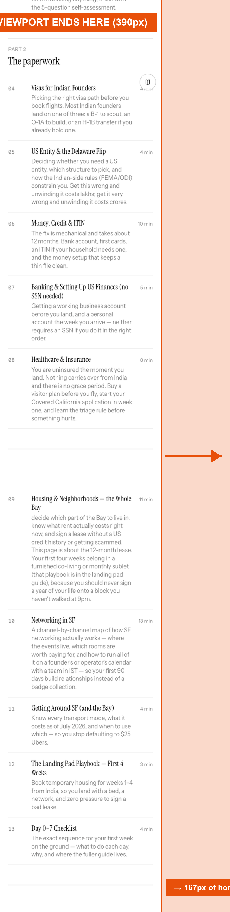

This is the "side scroll bar showing" issue. On a 390px mobile viewport, the bay-playbook document renders **557px wide** — 167px of horizontal overflow.

**Culprits** (measured on `/guides/the-bay-playbook`, mobile viewport):

| Element | Rendered width | Rendered right edge |
| --- | --- | --- |
| `.pbl__ch-body` | 434px | 510px |
| `.pbl__ch-title` | 434px | 510px |
| `.pbl__ch-dek small` | 434px | 510px |
| `.pbl__ch-meta caption` | 31px | **557px** |

The `.pbl__ch-meta` "4 min" chip is being placed after the card body without wrapping, and the card body itself is fixed-width rather than fluid.

**Fix suggestion:**
```css
/* on <=768px */
.pbl__ch-body, .pbl__ch-title, .pbl__ch-dek {
  max-width: 100%;
}
.pbl__ch { flex-wrap: wrap; }  /* or grid with meta below on mobile */
.pbl__ch-meta { align-self: flex-end; }
/* Belt + braces: */
html, body { overflow-x: hidden; }
```

---

## 3) Content package (v1 Bay Playbook)

**Repo:** [github.com/shonik-build/tff-bay-playbook-handoff](https://github.com/shonik-build/tff-bay-playbook-handoff)

**What's in it:**

- `content/` — one markdown file per page, plain-text content brief (headline, dek, sections, links). This is the source of truth Arnob (or a writer) can edit without touching HTML.
- `pages/` — 28 `.dc.html` files matching the existing template (the `x-dc` runtime already used on the live site). Drop-in ready.
- `design-system.md` — quick reference for the current design tokens (fonts, colors, spacing) so anything new stays consistent.
- `README.md` — how to preview locally, how the templates work, how to add a new page.
- `HANDOFF.md` — a copy of this doc.

**Sidebar structure (v1):**

```
S0 · DECIDING
  01  Reality Check + Who Should NOT Move
S1 · BEFORE YOU FLY
  02  Start With Your Decision
  03  Scout Trip
  04  Moving With Family
  05  Visas for Indian Founders
  06  Packing & What to Ship
BUSINESS · YOUR COMPANY
  07  US Entity & the Delaware Flip
  08  Business Banking
  09  Accelerators (YC / a16z / Neo)
  → Visas (cross-linked from S1)
S2 · GET YOUR US IDs
  10  SSN, ITIN & Driver's Licence
S3 · MONEY & CREDIT
  11  Money & Credit (US personal banking + credit-building)
  12  Send Money Home / NRI Banking
S4 · LANDING
  13  Landing Pad (first 1–4 weeks)
  14  Day 07 Checklist
  15  SIM + Phone
  16  Housing & Neighborhoods
  17  Healthcare & Insurance
  18  Getting Around SF
  19  Apps to Install Day 1
S5 · LIVE IN IT
  20  Networking in SF
  21  Live Events
  22  Groceries & Cooking
  23  Weekends & Escapes
  24  Remote Team Setup
  25  Culture Shocks
  26  SF ↔ India Travel
  27  Emergency Contacts
  28  Founder Directory
```

**How this maps to the wizard on the landing page:** the landing has a "Where are you in the move?" prompt with 6 stages (Deciding, Planning, Setting up the company, Week 1 on the ground, First month, Living here). Each stage jumps to a curated subset of pages instead of the full TOC.

**Sources this content was built from** (raw source files are in the repo under `sources/` for reference — not required to ship):

- Existing live site content
- Karan's SF guide (v1, expert)
- Conversation with Balu Murali (2026-09-03) — banking, ITIN, credit
- Conversation with Ajay Yadav (2026-09-03) — visas, entity, flip
- US Entity / Delaware Flip expert write-up
- Visas expert write-up (Section 4)

All feedback from Balu and Ajay is already integrated into the relevant pages — you don't need to cross-reference their notes separately.

---

## 4) What I'd change first

Not a priority list — just the order I'd tackle if this were mine:

1. Bay-playbook mobile horizontal scroll (§2.3) — 5-line CSS fix, blocks all mobile users.
2. Contact form submit button (§1.4 ⑪) — currently unusable form.
3. Bay-playbook nav "Build" duplication + 3× link title (§2.1 ⑭ ⑮) — accessibility + polish.
4. Hero `aria-label` character spacing on home + bay-playbook (§1.1 ③ / §2.1 ⑫) — accessibility.
5. Ship the v1 content pages from the repo.

Everything else is polish — happy to walk through any of it live.

---

## Files in this handoff bundle

```
tff-bay-playbook-handoff/
├── HANDOFF.md                          ← this doc
├── README.md
├── design-system.md
├── content/                            ← 28 plain-text content briefs (one per page)
├── pages/                              ← 28 .dc.html files + runtime + landing
├── sources/                            ← raw source materials
└── screenshots/
    ├── annotated/                      ← paste-ready into Google Doc (13 shots)
    │   ├── tff-bp-mobile-overflow.png  ← the critical one
    │   ├── tff-contact.png             ← the unusable form
    │   └── … (11 more)
    └── raw/                            ← unannotated originals (21 shots, including full-page captures)
```
